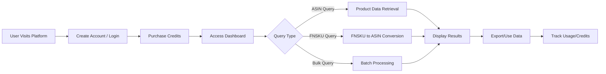
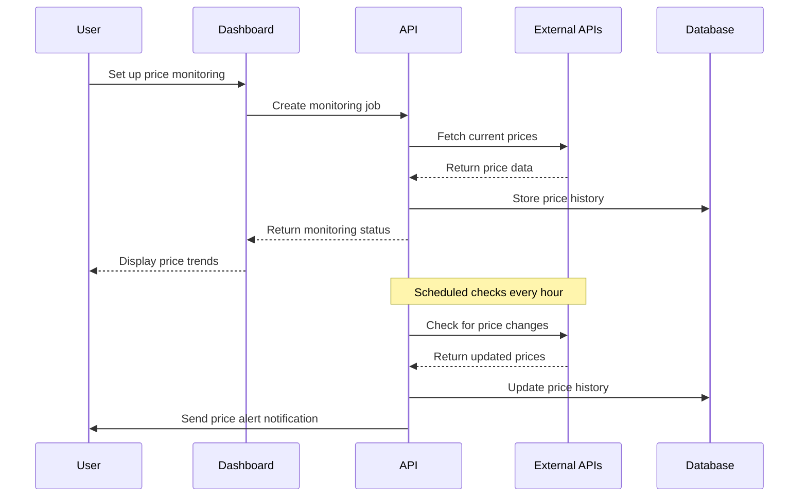
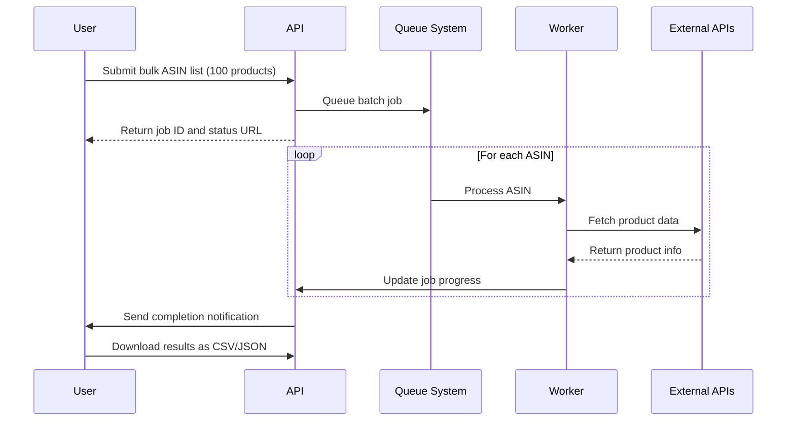
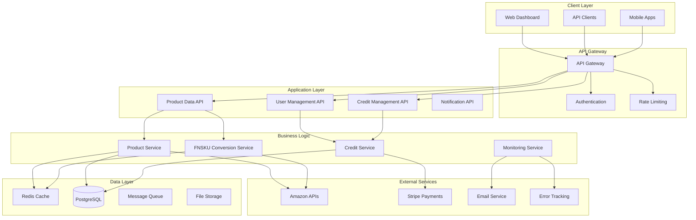
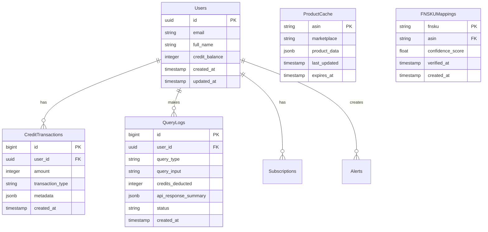
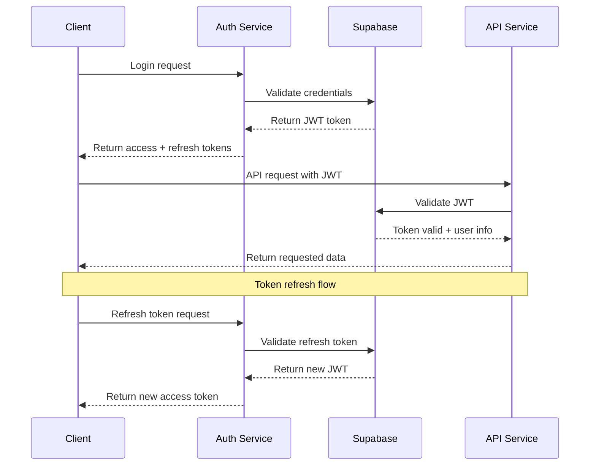
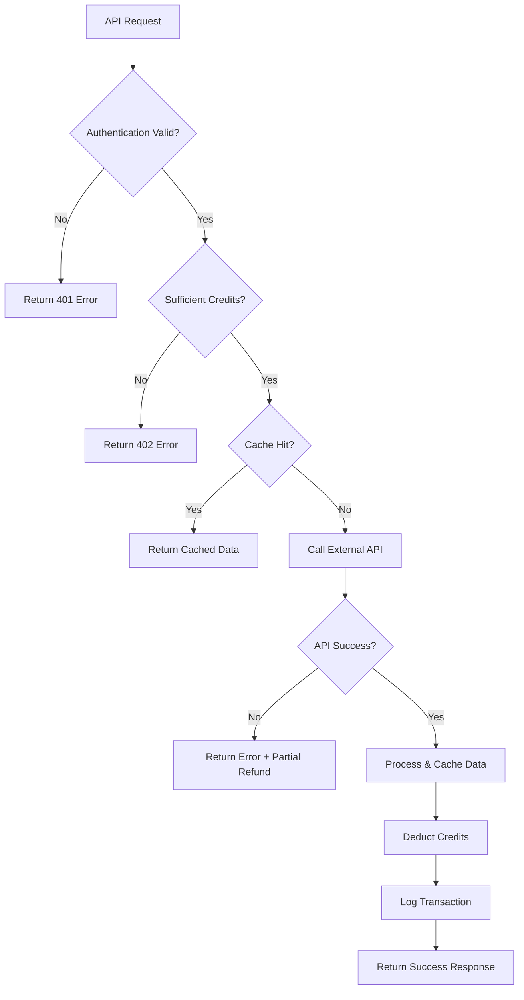
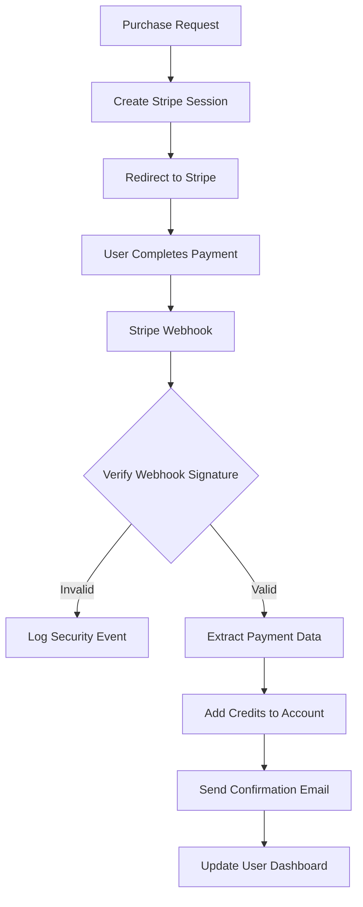
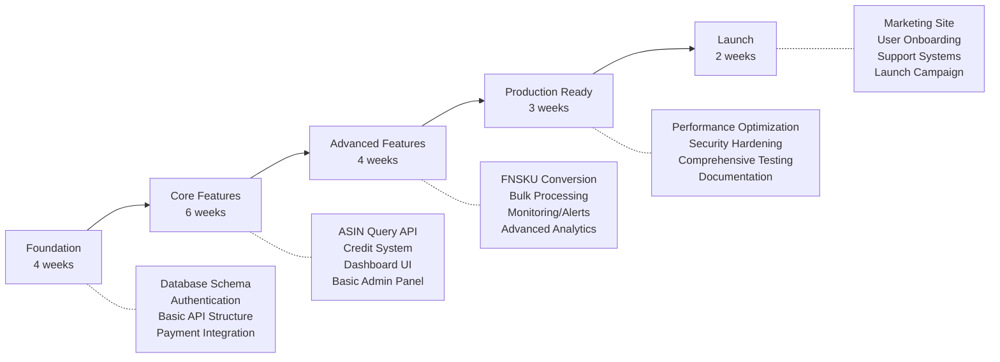

# Amazon Product Intelligence Platform - Product Requirements Document

## Executive Summary

### Problem Statement
E-commerce businesses, market researchers, and developers need real-time access to Amazon product data for competitive analysis, pricing optimization, and market intelligence. Current solutions are fragmented, expensive, or unreliable, forcing businesses to choose between incomplete free tools or enterprise solutions with complex pricing structures.

### Solution Overview
An API-first, credit-based SaaS platform that provides unified access to Amazon product intelligence through a modern, scalable architecture. The platform offers real-time product data, competitive pricing analysis, and market insights through a simple credit-based pricing model that scales with usage.

### Success Metrics
- **API Response Time**: < 200ms for 95% of requests
- **Data Accuracy**: > 99% for product information
- **User Retention**: > 80% monthly retention for paying customers
- **Revenue per User**: Average $50/month in credit purchases
- **API Reliability**: 99.9% uptime with graceful error handling

## Market Analysis & Context

### Market Landscape
The Amazon product data API market is valued at over $2B globally, with key players including:
- **Rainforest API**: Advanced AI-driven sales estimations
- **APISCRAPY**: AI-powered data extraction with high accuracy
- **Sellytics**: Real-time competitor monitoring
- **SellerApp**: Comprehensive seller analytics

### Market Opportunities
- **Growing Demand**: 14.57% CAGR in API management market through 2030
- **AI Integration**: Advanced AI for navigation and data extraction
- **Real-time Analytics**: Increasing need for instant competitive intelligence
- **Cost Efficiency**: Credit-based models preferred over complex enterprise pricing

### Target User Personas

#### Primary: E-commerce Entrepreneurs
- **Pain Points**: Manual competitor research, delayed pricing updates, scattered data sources
- **Needs**: Automated competitive analysis, real-time pricing alerts, market trend insights
- **Success Criteria**: Increased sales through optimized pricing, reduced research time

#### Secondary: Market Research Firms
- **Pain Points**: Expensive enterprise tools, limited data coverage, complex reporting
- **Needs**: Bulk data access, historical trends, comprehensive product catalogs
- **Success Criteria**: Faster client deliverables, reduced data acquisition costs

#### Tertiary: Software Developers
- **Pain Points**: Complex API integrations, rate limiting, inconsistent data formats
- **Needs**: Simple REST APIs, comprehensive documentation, predictable pricing
- **Success Criteria**: Fast integration, reliable service, transparent billing

## User Stories & Scenarios

### Primary User Flow



### User Stories

#### Epic 1: User Authentication & Onboarding
**As a new user**, I want to quickly create an account and understand the platform so that I can start accessing Amazon product data immediately.

**Acceptance Criteria:**
- [ ] Email/password registration with verification
- [ ] Social login options (Google, GitHub)
- [ ] Interactive onboarding tutorial
- [ ] Free trial credits (10 credits) automatically assigned
- [ ] Dashboard tour highlighting key features

**Edge Cases:**
- Invalid email formats handled gracefully
- Duplicate account prevention
- Password complexity requirements enforced

#### Epic 2: Credit Management System
**As a user**, I want to purchase and manage credits easily so that I can control my spending and usage.

**Acceptance Criteria:**
- [ ] Multiple credit packages available (100, 500, 1000, 5000 credits)
- [ ] Stripe checkout integration with saved payment methods
- [ ] Real-time credit balance display
- [ ] Usage history with detailed breakdowns
- [ ] Low credit balance warnings

**Edge Cases:**
- Payment failures handled with clear error messages
- Partial credit consumption for failed API calls
- Credit expiration policies clearly communicated

#### Epic 3: Amazon Product Data Queries
**As a developer/analyst**, I want to query Amazon product data by ASIN so that I can get comprehensive product information for my analysis.

**Acceptance Criteria:**
- [ ] REST API endpoint for ASIN queries
- [ ] Comprehensive product data returned (price, reviews, ratings, images, descriptions)
- [ ] Multiple marketplace support (US, UK, DE, JP, etc.)
- [ ] Rate limiting with clear error responses
- [ ] JSON response format with consistent schema

**Edge Cases:**
- Invalid ASIN format validation
- Product not found scenarios
- Marketplace-specific availability handling
- API rate limit exceeded responses

#### Epic 4: FNSKU to ASIN Conversion
**As an Amazon seller**, I want to convert FNSKU codes to ASINs so that I can analyze competitor products using their FBA barcodes.

**Acceptance Criteria:**
- [ ] FNSKU input validation and format checking
- [ ] High-accuracy conversion with confidence scoring
- [ ] Fallback mechanisms for unavailable conversions
- [ ] Clear error messages for invalid FNSKUs
- [ ] Bulk conversion support

**Edge Cases:**
- FNSKU not found in database
- Multiple ASIN matches for single FNSKU
- Expired or discontinued FNSKU codes
- Rate limiting for bulk conversions

### Critical User Scenarios

#### Scenario 1: Competitive Price Monitoring


#### Scenario 2: Bulk Product Analysis


## System Architecture

### High-Level Architecture



### Component Breakdown

#### Frontend Components
- **Dashboard**: React-based SPA with real-time updates
- **API Documentation**: Interactive Swagger UI
- **Admin Panel**: User management and system monitoring
- **Mobile App**: React Native for on-the-go access

#### Backend Services
- **Authentication Service**: JWT-based auth with Supabase
- **Product Data Service**: Core Amazon data integration
- **Credit Management Service**: Usage tracking and billing
- **FNSKU Conversion Service**: Specialized conversion algorithms
- **Notification Service**: Real-time alerts and email notifications

#### Data Models



## Technical Specifications

### API Design

#### Authentication Flow


### Core Endpoints

#### Product Data API
```yaml
POST /api/v1/product/asin
Request:
  asin: string (required, format: B[0-9A-Z]{9})
  marketplace: string (default: "US")
  include_reviews: boolean (default: false)
  include_offers: boolean (default: false)
  include_images: boolean (default: true)

Response:
  status: "success" | "error"
  credits_used: integer
  data:
    asin: string
    title: string
    price: object
    rating: number
    review_count: integer
    images: array
    description: string
    features: array
    availability: string
    marketplace: string
  
Errors:
  400: Invalid ASIN format
  401: Authentication required
  402: Insufficient credits
  404: Product not found
  429: Rate limit exceeded
```

#### FNSKU Conversion API
```yaml
POST /api/v1/convert/fnsku-to-asin
Request:
  fnsku: string (required, format: X[0-9A-Z]{9})
  marketplace: string (default: "US")

Response:
  status: "success" | "error"
  credits_used: integer
  data:
    fnsku: string
    asin: string
    confidence_score: number (0-1)
    product_title: string
    marketplace: string
  
Errors:
  400: Invalid FNSKU format
  401: Authentication required
  402: Insufficient credits
  404: FNSKU not found
  429: Rate limit exceeded
```

### Data Flow Patterns

#### Query Processing Flow


#### Credit Management Flow


## Implementation Strategy

### Development Phases



### Implementation Priority

#### Phase 1: Foundation (MVP Core)
**Week 1-2: Infrastructure Setup**
- Database schema design and migration system
- Supabase authentication integration
- FastAPI application structure with proper middleware
- Basic deployment pipeline with GitHub Actions

**Week 3-4: Payment & Credit System**
- Stripe integration for credit purchases
- Credit balance tracking and transaction logging
- Webhook handling for payment confirmations
- Basic user dashboard for credit management

#### Phase 2: Core Features (Functional MVP)
**Week 5-7: ASIN Query API**
- Amazon API integration for product data
- Caching layer with Redis for performance
- Credit deduction logic with transaction atomicity
- Rate limiting and error handling

**Week 8-10: User Interface Development**
- React dashboard with authentication flows
- API query interface with real-time results
- Credit purchase and management UI
- Query history and usage analytics

#### Phase 3: Advanced Features (Market Differentiation)
**Week 11-12: FNSKU Conversion Service**
- FNSKU to ASIN mapping database
- Machine learning confidence scoring
- Fallback mechanisms for failed conversions
- Bulk conversion processing

**Week 13-14: Monitoring & Analytics**
- Price monitoring and alerting system
- Advanced analytics dashboard
- Performance monitoring and error tracking
- Admin panel for user management

#### Phase 4: Production Readiness (Scale & Polish)
**Week 15-16: Performance & Security**
- Load testing and performance optimization
- Security audit and penetration testing
- Comprehensive API documentation
- Error handling and edge case coverage

**Week 17: Launch Preparation**
- Marketing website and landing pages
- User onboarding flow optimization
- Customer support system setup
- Launch campaign preparation

## Challenge & Risk Analysis

### Technical Risks

#### High Priority Risks

**1. FNSKU Conversion Reliability**
- **Risk**: Low accuracy in FNSKU to ASIN conversion affecting user trust
- **Mitigation**: 
  - Implement confidence scoring system
  - Build comprehensive test database
  - Provide fallback mechanisms and clear error messaging
  - Partner with existing FNSKU conversion services as backup

**2. Amazon API Rate Limiting**
- **Risk**: Exceeding rate limits causing service disruptions
- **Mitigation**:
  - Implement intelligent caching strategies
  - Use multiple API keys and rotation
  - Queue system for handling peak loads
  - Graceful degradation with cached data

**3. External API Dependencies**
- **Risk**: Amazon changing APIs or terms of service
- **Mitigation**:
  - Diversify data sources across multiple providers
  - Implement adapter pattern for easy API switching
  - Monitor API changes and deprecation notices
  - Legal review of terms of service compliance

#### Medium Priority Risks

**4. Payment Processing Failures**
- **Risk**: Stripe webhooks failing causing credit sync issues
- **Mitigation**:
  - Implement idempotent webhook handling
  - Manual reconciliation tools for admins
  - Backup webhook endpoints
  - Comprehensive payment event logging

**5. Data Privacy Compliance**
- **Risk**: Violating GDPR, CCPA, or other privacy regulations
- **Mitigation**:
  - Implement data retention policies
  - User data export and deletion capabilities
  - Privacy policy and terms of service review
  - Regular compliance audits

### Business Risks

**6. Market Competition**
- **Risk**: Existing players reducing prices or adding features
- **Mitigation**:
  - Focus on superior user experience
  - Unique features like advanced analytics
  - Strong customer relationship building
  - Continuous innovation pipeline

**7. Customer Acquisition Cost**
- **Risk**: High CAC reducing profitability
- **Mitigation**:
  - Content marketing and SEO strategy
  - Referral program for existing users
  - Freemium model with generous trial credits
  - Partnership with e-commerce tools

### Edge Cases & Scenarios

#### Scenario 1: Mass ASIN Deletion
**Challenge**: Amazon removes products, invalidating cached data
**Solution**: 
- Implement product availability checking
- Graceful handling of 404 responses
- Historical data preservation for analytics
- User notification of product removals

#### Scenario 2: Credit Fraud Prevention
**Challenge**: Users attempting to exploit credit system
**Solution**:
- Rate limiting per user and IP
- Anomaly detection for unusual usage patterns
- Manual review flags for large purchases
- Clear terms of service regarding abuse

#### Scenario 3: High Traffic Spikes
**Challenge**: Sudden traffic causing system overload
**Solution**:
- Auto-scaling infrastructure with Kubernetes
- Circuit breaker patterns for external APIs
- Priority queuing for paid vs. free users
- Real-time monitoring and alerting

## Success Criteria & Metrics

### Definition of Done
- [ ] All user stories implemented with acceptance criteria met
- [ ] Test coverage > 85% for backend services
- [ ] End-to-end testing for critical user flows
- [ ] Performance benchmarks met (< 200ms API response time)
- [ ] Security audit completed with no critical vulnerabilities
- [ ] Documentation complete (API docs, admin guides, user help)
- [ ] Monitoring and alerting systems operational
- [ ] Payment processing tested with real transactions

### Measurable Outcomes

#### Technical Metrics
- **API Performance**: 95th percentile response time < 200ms
- **Uptime**: 99.9% availability with < 1 hour total downtime/month  
- **Data Accuracy**: > 99% for ASIN product data, > 95% for FNSKU conversions
- **Cache Hit Rate**: > 80% for product data requests
- **Error Rate**: < 1% for successful API calls

#### Business Metrics
- **User Acquisition**: 1,000 registered users within 3 months
- **Revenue**: $10,000 MRR within 6 months
- **User Retention**: > 80% monthly retention for paying customers
- **Average Revenue per User**: $50/month in credit purchases
- **Credit Utilization**: > 70% of purchased credits used within 30 days

#### User Experience Metrics
- **Onboarding Completion**: > 90% of signups complete tutorial
- **Time to First Value**: < 5 minutes from signup to first query
- **Support Ticket Volume**: < 5% of users requiring support
- **Net Promoter Score**: > 50 based on quarterly surveys
- **Feature Adoption**: > 60% of users trying FNSKU conversion within first month

### Validation Commands

```bash
# Performance Testing
artillery run load-tests/api-load-test.yml
k6 run performance-tests/credit-flow-test.js

# API Contract Testing
newman run postman-collections/api-tests.json

# Security Testing
npm audit --audit-level high
safety check --full-report
bandit -r app/ -ll

# Data Quality Testing
python scripts/validate_product_data_accuracy.py
python scripts/test_fnsku_conversion_accuracy.py
```

## Appendices

### A. Competitive Analysis

| Feature | Our Platform | Rainforest API | APISCRAPY | Sellytics |
|---------|-------------|----------------|-----------|----------|
| Credit-based pricing | ✅ | ❌ | ❌ | ❌ |
| FNSKU conversion | ✅ | ❌ | ❌ | ❌ |
| Real-time data | ✅ | ✅ | ✅ | ✅ |
| Bulk processing | ✅ | ✅ | ✅ | ✅ |
| Free tier | ✅ | ❌ | ❌ | ❌ |
| Modern UI | ✅ | ❌ | ❌ | ⚠️ |

### B. Technical Architecture Decisions

**Why FastAPI over Django/Flask?**
- Superior async performance for I/O-bound operations
- Automatic API documentation generation
- Built-in request/response validation
- Type hints for better developer experience

**Why Supabase over Firebase/Auth0?**
- PostgreSQL as primary database
- Built-in Row Level Security
- Open source alternative
- Better pricing for our use case

**Why Credit-based vs. Subscription Model?**
- Better aligns cost with value for varied usage patterns
- Lower barrier to entry for new users
- Simplified billing for diverse API call types
- Improved cash flow through prepayment

### C. Market Research Data

Based on comprehensive market analysis:
- **Total Addressable Market**: $2.1B globally for product data APIs
- **Serviceable Addressable Market**: $180M for credit-based API platforms
- **Growth Rate**: 14.57% CAGR through 2030
- **Key Differentiators**: Credit pricing, FNSKU conversion, modern UX
- **Pricing Sweet Spot**: $0.01-0.05 per credit based on competitor analysis

This PRD provides the comprehensive foundation needed to build a successful Amazon Product Intelligence Platform that differentiates through superior user experience, fair pricing, and unique technical capabilities.